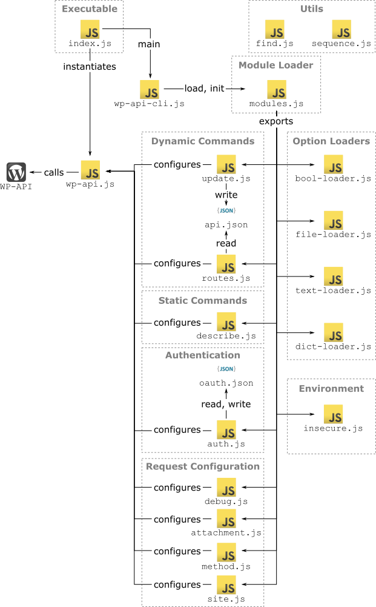

CLI for WordPress.org REST API v2
=================================


CLI to help test-drive the WordPress.org REST API.

Installing
----------

1. WP-API v2 depends on the latest WordPress.org, so [download it from Subversion](https://wordpress.org/download/svn/).
2. Install [WP-API plugin from Git](https://github.com/WP-API/WP-API) and activate it.
	- There are some fixes that I made concerning file uploads and missing metadata, consider using [the branch 'tnegri' of my fork](https://github.com/thiago-negri/WP-API/tree/tnegri) if the fixes are not already merged.
3. Install [Node.js](https://nodejs.org/).
4. Download this repository, and install it on your system: `npm install`.

### Authenticating with OAuth 1.0

1. Install [WP-API/OAuth1 from Git](https://github.com/WP-API/OAuth1) to support OAuth authentication, activate it.
    - There are some fixes that I made concerning signature checking, consider using [the branch 'tnegri' of my fork](https://github.com/thiago-negri/OAuth1/tree/tnegri) if the fixes are not already merged.
2. Install [WP-CLI](http://wp-cli.org/) to generate OAuth keys.
3. Go to your WordPress installation folder and create a new consumer key and secret for this CLI:

    ```bash
    wp oauth1 add
    ```

4. Authenticate this CLI:

    ```bash
    wp-api-cli --site=http://example.com \
        --oauth_key=CONSUMER_KEY         \
        --oauth_secret=CONSUMER_SECRET   \
        authenticate
    ```

5. It will ask for an authorization token. Follow the steps on the browser, copy the authorization token and paste it on console.
6. It will write the OAuth tokens to a file for further use -- this is a sensitive file, make sure to protect it!
7. When you execute a command, the CLI will look for the file to grab the OAuth tokens, you may set a different file to use with the option `--oauth_file`.
8. If you want to remove the OAuth tokens from the file system:

	```bash
	wp-api-cli logout
	```

### Authenticating with HTTP Basic Auth

1. Install [WP-API/Basic-Auth from Git](https://github.com/WP-API/Basic-Auth) to support HTTP Basic Authentication, activate it.
2. Use options `--http_user` and `--http_pass` with every request you make.

Commands
--------

After installing the CLI, you need to update its definition:

```bash
wp-api-cli --site=https://example.com update
```

After updating, ask for help to see everything available in your site:

```bash
wp-api-cli --help
```

See [docs/COMMANDS.md](docs/COMMANDS.md) for a full documentation on commands.

Developers
----------

This project is structured as follows:

1. [`index.js`](index.js) is the entry point, it executes the main function defined in [`lib/wp-api-cli.js`](lib/wp-api-cli.js).
1. [`lib/wp-api-cli.js`](lib/wp-api-cli.js) wires everything up.
1. [`lib/wp-api.js`](lib/wp-api.js) contains the class that communicates with the REST APIs.
1. [`lib/modules.js`](lib/modules.js) loads all modules. A module is an object that provides the functionalities of the CLI.
	- [`lib/modules/attachment.js`](lib/modules/attachment.js) handles attaching files to requests, used to upload media.
	- [`lib/modules/auth.js`](lib/modules/auth.js) handles authentication.
	- [`lib/modules/bool-loader.js`](lib/modules/bool-loader.js) handles boolean values in dynamic options.
	- [`lib/modules/debug.js`](lib/modules/debug.js) let you see debug messages.
	- [`lib/modules/describe.js`](lib/modules/describe.js) let you fetch a description of the API.
	- [`lib/modules/dict-loader.js`](lib/modules/dict-loader.js) handles transforming options into objects (`dict:` prefix).
	- [`lib/modules/file-loader.js`](lib/modules/file-loader.js) handles loading options from file (`file:` prefix).
	- [`lib/modules/insecure.js`](lib/modules/insecure.js) allows connection to insecure sites, e.g. with self signed certificates.
	- [`lib/modules/method.js`](lib/modules/method.js) sets which HTTP verb to use in request.
	- [`lib/modules/routes.js`](lib/modules/routes.js) handles all dynamic commands and options based on actual API description (plus some helpers).
	- [`lib/modules/site.js`](lib/modules/site.js) lets you set which site the CLI connects to.
	- [`lib/modules/text-loader.js`](lib/modules/text-loader.js) handles `text:` prefix.
	- [`lib/modules/update.js`](lib/modules/update.js) fetches API description and writes it to a file for further use by [`lib/modules/routes.js`](lib/modules/routes.js).
1. Files in [`lib/utils`](lib/utils) are utility functions to make coding easier.

If you want to create a new set of commands, drop a file in `lib/modules` and load it in `modules.js`. Full explanation in [docs/MODULES.md](docs/MODULES.md).

Useful Links
------------

- [WordPress.org Subversion download](https://wordpress.org/download/svn/)
- [WP-API project on GitHub](https://github.com/WP-API/WP-API)
- [Online documentation for WP-API v2](http://v2.wp-api.org/)
- [WP-API/OAuth1 project on GitHub](https://github.com/WP-API/OAuth1)
- [WP-API/Basic-Auth project on GitHub](https://github.com/WP-API/Basic-Auth)
- [Node.js](https://nodejs.org/)
- [WP-CLI](http://wp-cli.org/)

Related Issues and Pull Requests
--------------------------------

### Issues

- [WP-API/WP-API: API description for user creation](https://github.com/WP-API/WP-API/issues/1514)

### Fixes

- [WP-API/WP-API: Fix file upload for attachments](https://github.com/WP-API/WP-API/pull/1492)
- [WP-API/WP-API: Fix MD5 check on file uploads](https://github.com/WP-API/WP-API/pull/1508)
- [WP-API/WP-API: Add missing 'force' arg to posts-terms DELETE](https://github.com/WP-API/WP-API/pull/1512)
- [WP-API/WP-API: Add missing 'force' argument to Users DELETE](https://github.com/WP-API/WP-API/pull/1515)
- [WP-API/WP-API: Add missing 'force' arg to Meta DELETE](https://github.com/WP-API/WP-API/pull/1517)
- [WP-API/WP-API: Fix typo in message](https://github.com/WP-API/WP-API/pull/1516)
- [WP-API/OAuth1: Fix signature check for sub-folder WP installs](https://github.com/WP-API/OAuth1/pull/78)
- [WP-API/OAuth1: Fix signature for params with special chars](https://github.com/WP-API/OAuth1/pull/79)
- [niallsmart/node-oauth-like: Fix signature with queryString](https://github.com/niallsmart/node-oauth-lite/pull/1)

### Features

- [WP-API/WP-API: Add help properties to endpoint arguments](https://github.com/WP-API/WP-API/pull/1511)
- [WP-API/OAuth1: Add filter to signal error for WP-API v2](https://github.com/WP-API/OAuth1/pull/80)

Project Overview
----------------


